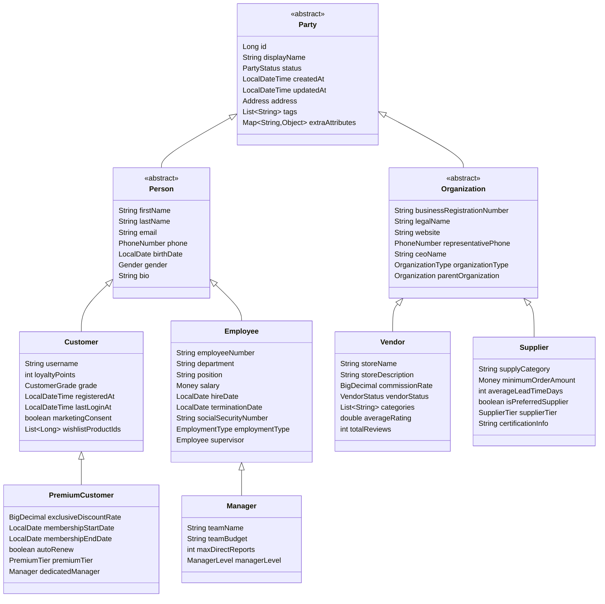
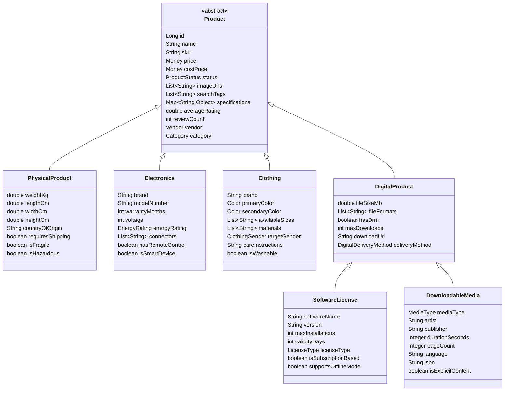
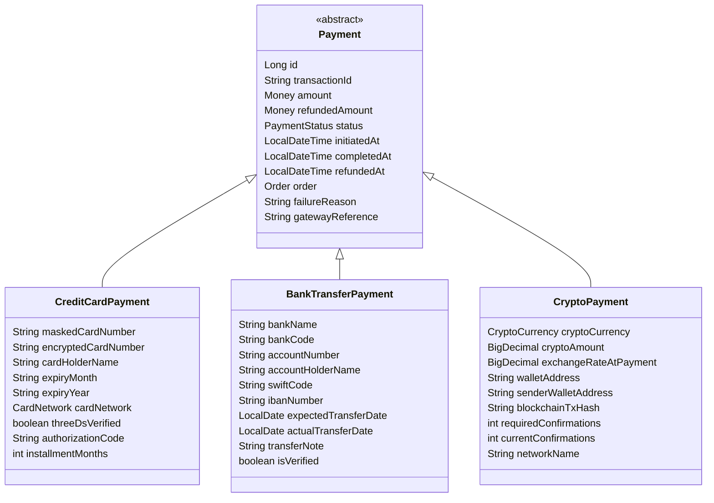
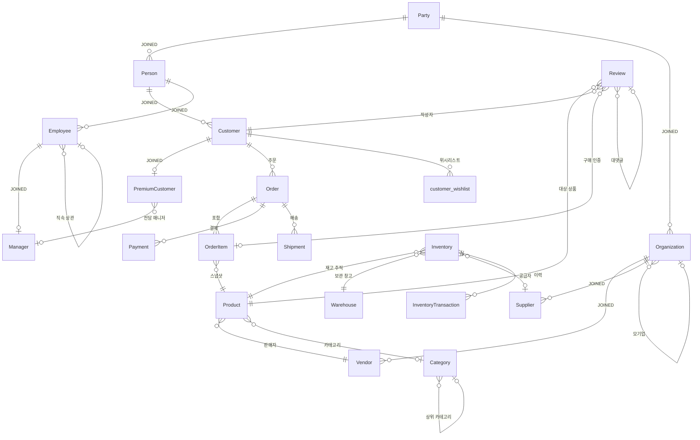
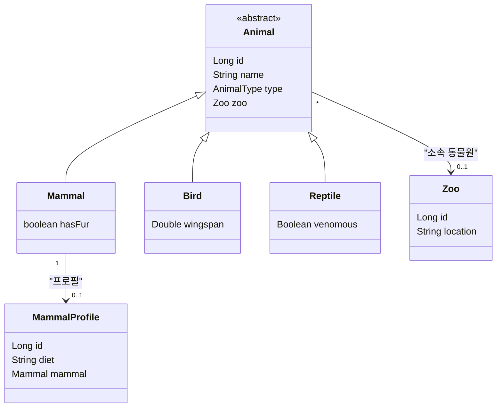

# jinx-test

[jinx](https://github.com/yyubin/jinx)의 **검증 쇼케이스** 프로젝트입니다. jinx는 JPA/Hibernate 프로젝트를 위한 스키마 스냅샷 & 마이그레이션 SQL 생성 라이브러리입니다.

이 프로젝트는 jinx가 실제 프로덕션 수준의 JPA 시나리오를 올바르게 처리할 수 있음을 증명하기 위해 의도적으로 **복잡한 엔티티 모델**을 정의합니다. 다단계 JOINED 상속, 임베디드 값 객체, 커스텀 컨버터, 자기 참조 관계, 도메인 간 FK 참조 등 다양한 케이스를 포함합니다.

---

## 기술 스택

| | |
|---|---|
| Java | 21 |
| Spring Boot | 3.5.5 |
| Database | MySQL 8 |
| jinx | `0.1.2` |

---

## 실행 방법

### 1. `build.gradle`에 jinx 추가

```gradle
plugins {
    id("io.github.yyubin.jinx") version "0.1.2"
}

dependencies {
    implementation "io.github.yyubin:jinx-core:0.1.2"
    annotationProcessor "io.github.yyubin:jinx-processor:0.1.2"
}

configurations { jinxCli }

dependencies {
    jinxCli "io.github.yyubin:jinx-cli:0.1.2"
}

tasks.register('jinx', JavaExec) {
    group = 'jinx'
    classpath = configurations.jinxCli
    mainClass = 'org.jinx.cli.JinxCli'
    args 'db', 'migrate'
    dependsOn 'classes'
}
```

### 2. 컴파일 및 스키마 스냅샷 생성

```bash
./gradlew classes
```

Annotation Processor가 `build/classes/java/main/jinx/`에 스키마 스냅샷 JSON을 생성합니다.

### 3. 마이그레이션 SQL 생성

```bash
./gradlew jinx
```

버전이 포함된 마이그레이션 SQL이 `build/jinx/`에 생성됩니다.

---

## 엔티티 모델

이 프로젝트는 두 개의 도메인에 걸쳐 **35개 테이블**을 정의합니다.

### Party 계층 — 4단계 JOINED 상속



### Product 계층 — 2단계 JOINED 상속



### Payment 계층 — 2단계 JOINED 상속



### 전체 도메인 관계



### Animal 도메인 (샘플 JOINED 계층)



---

## jinx가 정확히 처리하는 것들

이 모델은 JPA 매핑의 주요 시나리오 전반에 걸쳐 스키마 생성을 검증하도록 설계되었습니다.
`build/jinx/`에 생성된 SQL은 아래의 모든 케이스를 올바르게 통과합니다.

### ✅ 다단계 JOINED 상속 — 즉시 부모 테이블을 향한 정확한 FK 체인

각 자식 테이블은 **자신만의 컬럼만** 보유하고, **즉시 부모 테이블**을 참조합니다. 루트 테이블을 직접 가리키지 않습니다.

```sql
-- 4단계 깊이: Party → Person → Customer → PremiumCustomer
ALTER TABLE `Person`          ADD CONSTRAINT ... FOREIGN KEY (`id`) REFERENCES `Party` (`id`);
ALTER TABLE `Customer`        ADD CONSTRAINT ... FOREIGN KEY (`id`) REFERENCES `Person` (`id`);
ALTER TABLE `PremiumCustomer` ADD CONSTRAINT ... FOREIGN KEY (`id`) REFERENCES `Customer` (`id`);
ALTER TABLE `Manager`         ADD CONSTRAINT ... FOREIGN KEY (`id`) REFERENCES `Employee` (`id`);
ALTER TABLE `Vendor`          ADD CONSTRAINT ... FOREIGN KEY (`id`) REFERENCES `Organization` (`id`);
```

### ✅ AttributeOverride를 통한 임베디드 값 객체

`Address` VO가 여러 엔티티에서 서로 다른 컬럼 prefix로 재사용됩니다. 모두 정확히 분리됩니다.

```sql
-- Party: addr_*   Order: ship_* 와 bill_*   Warehouse: wh_*
CREATE TABLE `Party` (
  `addr_street` VARCHAR(200), `addr_city` VARCHAR(100),
  `addr_state` VARCHAR(100),  `addr_postal_code` VARCHAR(20), `addr_country` VARCHAR(100), ...
);
CREATE TABLE `Order` (
  `ship_street` VARCHAR(200), `ship_city` VARCHAR(100), ...   -- 배송지 주소
  `bill_street` VARCHAR(200), `bill_city` VARCHAR(100), ...   -- 청구지 주소
);
```

### ✅ 커스텀 AttributeConverter — 컬럼 타입 및 길이 정확 반영

모든 컨버터가 `@Column(length=N)` 선언값을 정확히 반영합니다. `TEXT` 폴백 없음.

| 컨버터 | 예시 필드 | 생성된 컬럼 타입 |
|--------|----------|:---------------:|
| `MoneyConverter` | `price`, `salary`, `amount` | `VARCHAR(30)` |
| `PhoneNumberConverter` | `phone`, `representative_phone` | `VARCHAR(20)` |
| `EncryptedStringConverter` | `ssn_encrypted`, `card_number_encrypted` | `VARCHAR(500)` |
| `ColorConverter` | `primary_color`, `secondary_color` | `VARCHAR(10)` |
| `CommaSeparatedListConverter` | `tags`, `search_tags`, `categories` | `VARCHAR(N)` |
| `JsonMapConverter` | `specifications`, `extra_attributes` | `TEXT` |

### ✅ 자기 참조 FK

```sql
ALTER TABLE `Category`     FOREIGN KEY (`parent_id`)        REFERENCES `Category` (`id`);
ALTER TABLE `Review`       FOREIGN KEY (`parent_review_id`) REFERENCES `Review` (`id`);
ALTER TABLE `Employee`     FOREIGN KEY (`supervisor_id`)     REFERENCES `Employee` (`id`);
ALTER TABLE `Organization` FOREIGN KEY (`parent_org_id`)     REFERENCES `Organization` (`id`);
```

### ✅ `@ElementCollection` 조인 테이블

`Customer.wishlistProductIds` (`List<Long>`)는 `customer_id` FK만 가진 조인 테이블을 생성합니다. 스칼라 타입이므로 `product_id` FK가 없는 것이 정상이며, 이를 올바르게 처리합니다.

```sql
CREATE TABLE `customer_wishlist` (
  `customer_id` BIGINT NOT NULL,
  `product_id`  BIGINT NOT NULL,
  PRIMARY KEY (`customer_id`, `product_id`)
);
ALTER TABLE `customer_wishlist` FOREIGN KEY (`customer_id`) REFERENCES `Customer` (`id`);
```

### ✅ 상속 계층 간 교차 FK

`PremiumCustomer`(Party/Person/Customer 계통)가 `Manager`(Party/Person/Employee 계통)를 FK로 참조합니다. 서로 다른 상속 트리를 가로지르는 참조가 정확히 처리됩니다.

```sql
ALTER TABLE `PremiumCustomer`
  ADD CONSTRAINT ... FOREIGN KEY (`dedicated_manager_id`) REFERENCES `Manager` (`id`);
```

### ✅ `@Version` — Optimistic Locking

```sql
CREATE TABLE `Inventory` (
  `version` BIGINT,   -- 동시 재고 차감 충돌 방지용 Optimistic Lock
  ...
);
```

### ✅ boolean 필드 `is`-prefix 제거 컬럼명 변환

```sql
-- Java: private boolean isActive = true;
`active` TINYINT(1) NOT NULL DEFAULT '0'

-- Java: private boolean isPreferredSupplier = false;
`preferredSupplier` TINYINT(1) NOT NULL DEFAULT '0'
```

### ✅ ENUM, UNIQUE, NOT NULL, DECIMAL 정밀도

`@Enumerated(STRING)`, `unique = true`, `nullable = false`, `precision/scale` 선언이 생성된 DDL에 빠짐없이 반영됩니다.

---

## 생성된 SQL 샘플

```sql
-- Jinx Migration Header
-- jinx:baseline=sha256:initial
-- jinx:head=sha256:74945ebf5c863ed036b04ca2a4e47e2f542046d1aafcb1f6a673f40bdb2de5e2
-- jinx:version=20260309212400
-- jinx:generated=2026-03-09T21:24:02.038133

CREATE TABLE `Party` (
  `status` ENUM('ACTIVE','SUSPENDED','DORMANT','TERMINATED') NOT NULL,
  `updatedAt` TIMESTAMP(6) NOT NULL,
  `addr_state` VARCHAR(100),
  `addr_city` VARCHAR(100),
  `addr_country` VARCHAR(100),
  `extra_attributes` TEXT,
  `displayName` VARCHAR(200) NOT NULL,
  `createdAt` TIMESTAMP(6) NOT NULL,
  `addr_street` VARCHAR(200),
  `tags` VARCHAR(500),
  `addr_postal_code` VARCHAR(20),
  `id` BIGINT NOT NULL AUTO_INCREMENT,
  PRIMARY KEY (`id`)
) ENGINE=InnoDB DEFAULT CHARSET=utf8mb4 COLLATE=utf8mb4_unicode_ci;

CREATE TABLE `Person` (
  `gender` ENUM('MALE','FEMALE','NON_BINARY','PREFER_NOT_TO_SAY'),
  `phone` VARCHAR(20),
  `firstName` VARCHAR(50) NOT NULL,
  `lastName` VARCHAR(50) NOT NULL,
  `email` VARCHAR(320),
  `id` BIGINT NOT NULL,
  `birthDate` DATE,
  `bio` TEXT,
  PRIMARY KEY (`id`),
  CONSTRAINT `uq_person__email` UNIQUE (`email`)
) ENGINE=InnoDB DEFAULT CHARSET=utf8mb4 COLLATE=utf8mb4_unicode_ci;

CREATE TABLE `Customer` (
  `grade` ENUM('BRONZE','SILVER','GOLD','PLATINUM','DIAMOND') NOT NULL,
  `lastLoginAt` TIMESTAMP(6),
  `username` VARCHAR(50) NOT NULL,
  `id` BIGINT NOT NULL,
  `registeredAt` TIMESTAMP(6) NOT NULL,
  `loyaltyPoints` INT NOT NULL,
  `marketingConsent` TINYINT(1) NOT NULL DEFAULT '0',
  PRIMARY KEY (`id`),
  CONSTRAINT `uq_customer__username` UNIQUE (`username`)
) ENGINE=InnoDB DEFAULT CHARSET=utf8mb4 COLLATE=utf8mb4_unicode_ci;

CREATE TABLE `PremiumCustomer` (
  `premiumTier` ENUM('BASIC','PLUS','ELITE','VIP') NOT NULL,
  `membershipEndDate` DATE,
  `dedicated_manager_id` BIGINT,
  `exclusiveDiscountRate` DECIMAL(5,4) NOT NULL,
  `membershipStartDate` DATE NOT NULL,
  `autoRenew` TINYINT(1) NOT NULL DEFAULT '0',
  `id` BIGINT NOT NULL,
  PRIMARY KEY (`id`)
) ENGINE=InnoDB DEFAULT CHARSET=utf8mb4 COLLATE=utf8mb4_unicode_ci;

-- FK 체인: PremiumCustomer → Customer → Person → Party
ALTER TABLE `Person`          ADD CONSTRAINT `fk_person__id__party`          FOREIGN KEY (`id`) REFERENCES `Party` (`id`);
ALTER TABLE `Customer`        ADD CONSTRAINT `fk_customer__id__person`        FOREIGN KEY (`id`) REFERENCES `Person` (`id`);
ALTER TABLE `PremiumCustomer` ADD CONSTRAINT `fk_premiumcustomer__id_50f2b74` FOREIGN KEY (`id`) REFERENCES `Customer` (`id`);

-- 상속 계층 간 교차 FK: PremiumCustomer → Manager (다른 상속 브랜치)
ALTER TABLE `PremiumCustomer` ADD CONSTRAINT `fk_premiumcustomer__d_5c398235` FOREIGN KEY (`dedicated_manager_id`) REFERENCES `Manager` (`id`);
```

---

## 테스트 시나리오 기여하기

이 저장소는 실제 프로덕션 수준의 JPA 복잡성을 기준으로 jinx를 검증하기 위해 존재합니다.
테스트해보고 싶은 매핑 패턴이 있거나, jinx가 제대로 처리하지 못할 것 같은 케이스가 있다면 **이슈나 PR을 올려주시면 매우 환영합니다**.

특히 다음 시나리오에 대한 검증이 필요합니다:

- `@ManyToMany` — 추가 컬럼이 있는 커스텀 조인 테이블
- `TABLE_PER_CLASS` 상속 전략
- `SINGLE_TABLE` 상속 + `@DiscriminatorColumn`
- 단일 계층 내 혼합 상속 전략
- `@SecondaryTable` 활용
- 복합 기본키 (`@EmbeddedId`, `@IdClass`)
- 공유 PK 방식의 `@OneToOne` (`@MapsId`)
- `@Formula` 또는 DB 계산 컬럼이 있는 엔티티
- 멀티테넌시 스키마 패턴

jinx가 여러분의 시나리오를 올바르게 처리한다면, 이곳의 통과된 테스트 케이스가 살아있는 증거가 됩니다.
처리하지 못한다면, 여러분의 리포트가 다음 수정 우선순위를 결정하는 데 직접적인 도움이 됩니다.

[github.com/yyubin/jinx](https://github.com/yyubin/jinx)에 이슈를 올리거나,
이 저장소의 `src/main/java/org/jinx/jinxtest/` 하위에 엔티티 시나리오를 추가해 PR을 보내주세요.

---

## jinx 소개

**jinx**는 JPA 스키마 스냅샷 & 버전 관리 마이그레이션 SQL 생성기입니다.
Annotation Processor로 동작하기 때문에 런타임 오버헤드가 없고 외부 서비스도 필요 없습니다.

- 컴파일 타임에 JPA 엔티티 클래스를 분석
- 스키마 스냅샷 JSON 생성 (`build/classes/java/main/jinx/`)
- 스냅샷 diff를 통해 체크섬이 포함된 버전 관리 마이그레이션 SQL 생성 (`build/jinx/`)

**저장소**: [https://github.com/yyubin/jinx](https://github.com/yyubin/jinx)
