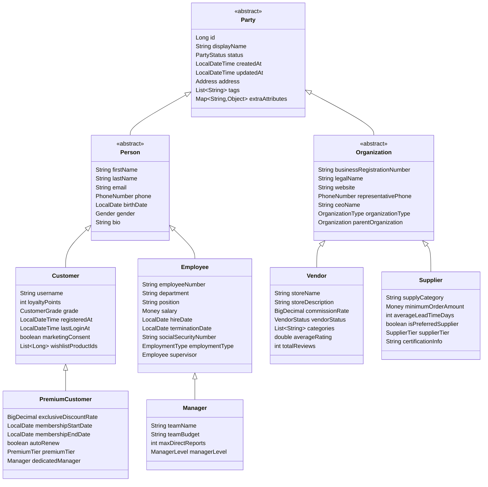
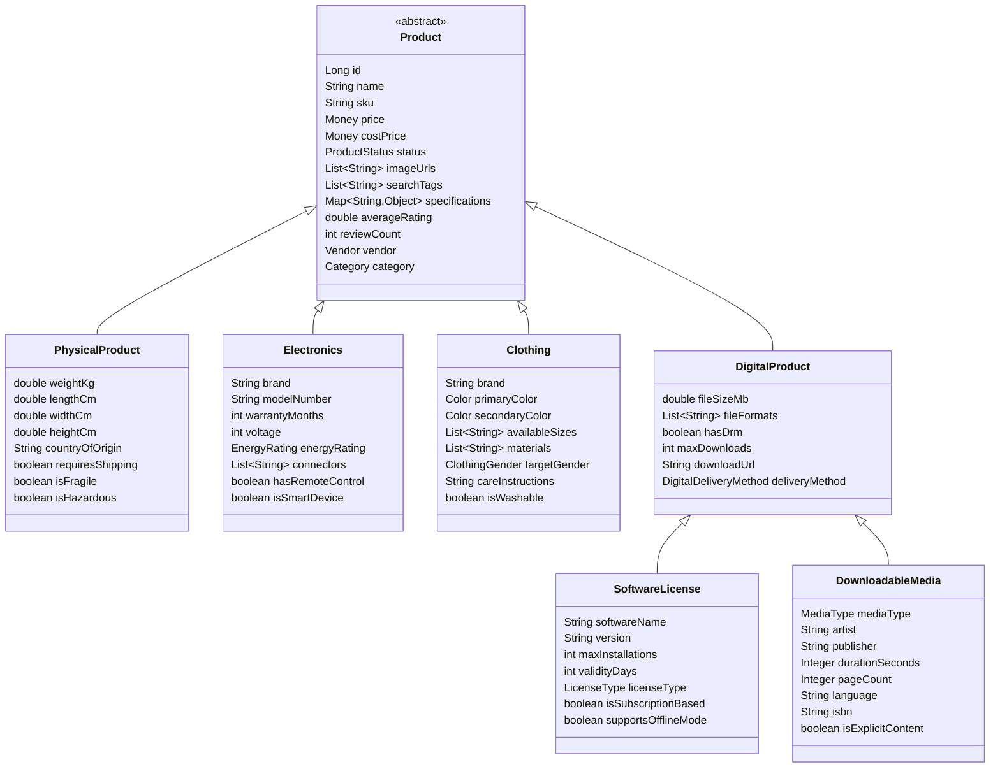
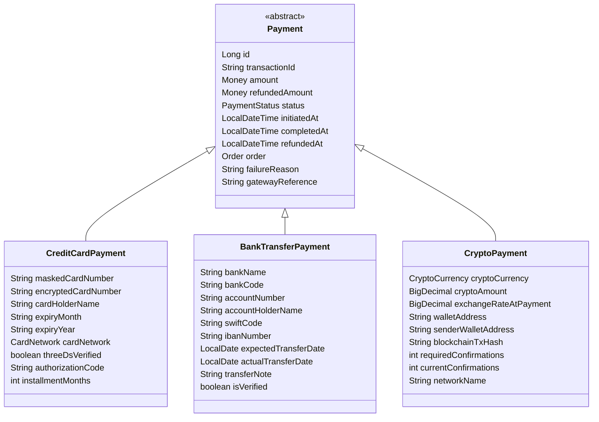
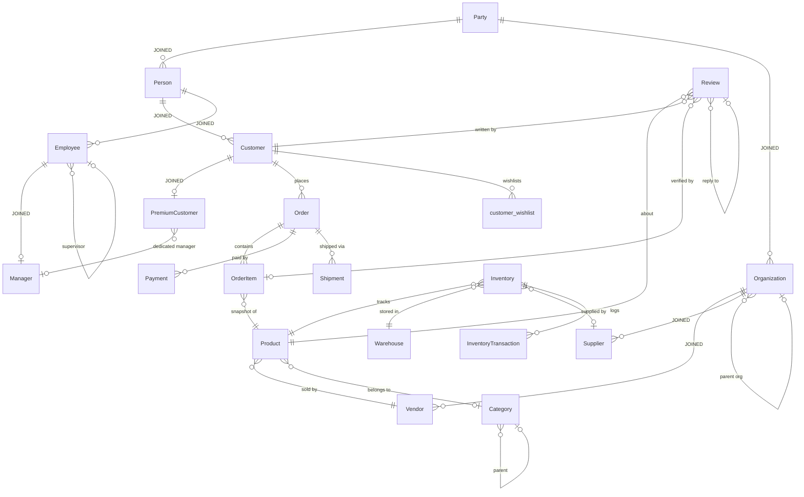

# jinx-test

> 🇰🇷 [한국어 문서 보기](./README.ko.md)

A **validation showcase** for [jinx](https://github.com/yyubin/jinx) — a schema snapshot & migration SQL generator for JPA/Hibernate projects.

This project deliberately defines a **production-grade, deeply complex entity model** to prove that jinx handles real-world JPA scenarios correctly: multi-level JOINED inheritance, embedded value objects, custom converters, self-referencing relationships, and cross-domain FK references.

---

## Stack

| | |
|---|---|
| Java | 21 |
| Spring Boot | 3.5.5 |
| Database | MySQL 8 |
| jinx | `0.1.2` |

---

## How to Run

### 1. Add jinx to `build.gradle`

```gradle
plugins {
    id("io.github.yyubin.jinx") version "0.1.2"
}

dependencies {
    implementation "io.github.yyubin:jinx-core:0.1.2"
    annotationProcessor "io.github.yyubin:jinx-processor:0.1.2"
}

configurations { jinxCli }

dependencies {
    jinxCli "io.github.yyubin:jinx-cli:0.1.2"
}

tasks.register('jinx', JavaExec) {
    group = 'jinx'
    classpath = configurations.jinxCli
    mainClass = 'org.jinx.cli.JinxCli'
    args 'db', 'migrate'
    dependsOn 'classes'
}
```

### 2. Compile & generate schema snapshot

```bash
./gradlew classes
```

The annotation processor emits a schema snapshot JSON to `build/classes/java/main/jinx/`.

### 3. Generate migration SQL

```bash
./gradlew jinx
```

The versioned migration SQL is written to `build/jinx/`.

---

## Entity Model

This project defines **35 tables** across two domains.

### Party Hierarchy — 4-level JOINED Inheritance



### Product Hierarchy — 2-level JOINED Inheritance



### Payment Hierarchy — 2-level JOINED Inheritance



### Domain Relationships



---

## What jinx Gets Right

This model was designed to stress-test schema generation across every major JPA mapping scenario.
The generated SQL at `build/jinx/` passes all of the following:

### ✅ Multi-level JOINED Inheritance with Correct FK Chaining

Each child table holds **only its own columns** and references its **immediate parent** — not the root.

```sql
-- 4-level deep: Party → Person → Customer → PremiumCustomer
ALTER TABLE `Person`          ADD CONSTRAINT ... FOREIGN KEY (`id`) REFERENCES `Party` (`id`);
ALTER TABLE `Customer`        ADD CONSTRAINT ... FOREIGN KEY (`id`) REFERENCES `Person` (`id`);
ALTER TABLE `PremiumCustomer` ADD CONSTRAINT ... FOREIGN KEY (`id`) REFERENCES `Customer` (`id`);
ALTER TABLE `Manager`         ADD CONSTRAINT ... FOREIGN KEY (`id`) REFERENCES `Employee` (`id`);
ALTER TABLE `Vendor`          ADD CONSTRAINT ... FOREIGN KEY (`id`) REFERENCES `Organization` (`id`);
```

### ✅ Embedded Value Objects with Attribute Overrides

`Address` is reused across multiple entities with distinct column prefixes — all resolved correctly.

```sql
-- Party: addr_*   Order: ship_* and bill_*   Warehouse: wh_*
CREATE TABLE `Party` (
  `addr_street` VARCHAR(200), `addr_city` VARCHAR(100),
  `addr_state` VARCHAR(100),  `addr_postal_code` VARCHAR(20), `addr_country` VARCHAR(100), ...
);
CREATE TABLE `Order` (
  `ship_street` VARCHAR(200), `ship_city` VARCHAR(100), ...   -- shipping address
  `bill_street` VARCHAR(200), `bill_city` VARCHAR(100), ...   -- billing address
);
```

### ✅ Custom AttributeConverters with Correct Column Types and Lengths

All converters produce the declared `@Column(length=N)` output, not a fallback `TEXT`.

| Converter | Example field | Generated column |
|-----------|--------------|-----------------|
| `MoneyConverter` | `price`, `salary`, `amount` | `VARCHAR(30)` |
| `PhoneNumberConverter` | `phone`, `representative_phone` | `VARCHAR(20)` |
| `EncryptedStringConverter` | `ssn_encrypted`, `card_number_encrypted` | `VARCHAR(500)` |
| `ColorConverter` | `primary_color`, `secondary_color` | `VARCHAR(10)` |
| `CommaSeparatedListConverter` | `tags`, `search_tags`, `categories` | `VARCHAR(N)` |
| `JsonMapConverter` | `specifications`, `extra_attributes` | `TEXT` |

### ✅ Self-Referencing FK

```sql
ALTER TABLE `Category`     FOREIGN KEY (`parent_id`)        REFERENCES `Category` (`id`);
ALTER TABLE `Review`       FOREIGN KEY (`parent_review_id`) REFERENCES `Review` (`id`);
ALTER TABLE `Employee`     FOREIGN KEY (`supervisor_id`)     REFERENCES `Employee` (`id`);
ALTER TABLE `Organization` FOREIGN KEY (`parent_org_id`)     REFERENCES `Organization` (`id`);
```

### ✅ `@ElementCollection` Join Table

`Customer.wishlistProductIds` (`List<Long>`) generates a join table with only a `customer_id` FK — no spurious `product_id` FK since the element is a scalar.

```sql
CREATE TABLE `customer_wishlist` (
  `customer_id` BIGINT NOT NULL,
  `product_id`  BIGINT NOT NULL,
  PRIMARY KEY (`customer_id`, `product_id`)
);
ALTER TABLE `customer_wishlist` FOREIGN KEY (`customer_id`) REFERENCES `Customer` (`id`);
```

### ✅ Cross-Hierarchy FK

`PremiumCustomer` (under the Party/Person/Customer branch) holds a FK to `Manager` (under the Party/Person/Employee branch) — correctly resolved across inheritance trees.

```sql
ALTER TABLE `PremiumCustomer`
  ADD CONSTRAINT ... FOREIGN KEY (`dedicated_manager_id`) REFERENCES `Manager` (`id`);
```

### ✅ `@Version` for Optimistic Locking

```sql
CREATE TABLE `Inventory` (
  `version` BIGINT,   -- @Version field for optimistic locking
  ...
);
```

### ✅ `is`-prefix Stripping for Boolean Column Names

```sql
-- Java: private boolean isActive = true;
`active` TINYINT(1) NOT NULL DEFAULT '0'

-- Java: private boolean isPreferredSupplier = false;
`preferredSupplier` TINYINT(1) NOT NULL DEFAULT '0'
```

### ✅ ENUM, UNIQUE, NOT NULL, DECIMAL Precision

Every `@Enumerated(STRING)`, `unique = true`, `nullable = false`, and `precision/scale` declaration is faithfully reflected in the generated DDL.

---

## Actual Output

The generated schema snapshot and migration SQL produced from this project's entity model are committed directly to the repository for reference.

```
src/main/java/org/jinx/jinxtest/jinxoutput/
├── json/
│   └── schema-20260309225310.json                          # Schema snapshot
└── sql/
    └── V20260309225310__migration__jinxHead_sha256_....sql  # Migration SQL
```

- **`json/`** — Schema snapshot captured by the annotation processor at compile time. Contains the full structural representation of every entity.
- **`sql/`** — Versioned migration SQL ready to apply against a MySQL database. Filename includes a SHA-256 checksum of the snapshot for integrity verification.

---

## Generated SQL Sample

```sql
-- Jinx Migration Header
-- jinx:baseline=sha256:initial
-- jinx:head=sha256:74945ebf5c863ed036b04ca2a4e47e2f542046d1aafcb1f6a673f40bdb2de5e2
-- jinx:version=20260309212400
-- jinx:generated=2026-03-09T21:24:02.038133

CREATE TABLE `Party` (
  `status` ENUM('ACTIVE','SUSPENDED','DORMANT','TERMINATED') NOT NULL,
  `updatedAt` TIMESTAMP(6) NOT NULL,
  `addr_state` VARCHAR(100),
  `addr_city` VARCHAR(100),
  `addr_country` VARCHAR(100),
  `extra_attributes` TEXT,
  `displayName` VARCHAR(200) NOT NULL,
  `createdAt` TIMESTAMP(6) NOT NULL,
  `addr_street` VARCHAR(200),
  `tags` VARCHAR(500),
  `addr_postal_code` VARCHAR(20),
  `id` BIGINT NOT NULL AUTO_INCREMENT,
  PRIMARY KEY (`id`)
) ENGINE=InnoDB DEFAULT CHARSET=utf8mb4 COLLATE=utf8mb4_unicode_ci;

CREATE TABLE `Person` (
  `gender` ENUM('MALE','FEMALE','NON_BINARY','PREFER_NOT_TO_SAY'),
  `phone` VARCHAR(20),
  `firstName` VARCHAR(50) NOT NULL,
  `lastName` VARCHAR(50) NOT NULL,
  `email` VARCHAR(320),
  `id` BIGINT NOT NULL,
  `birthDate` DATE,
  `bio` TEXT,
  PRIMARY KEY (`id`),
  CONSTRAINT `uq_person__email` UNIQUE (`email`)
) ENGINE=InnoDB DEFAULT CHARSET=utf8mb4 COLLATE=utf8mb4_unicode_ci;

CREATE TABLE `Customer` (
  `grade` ENUM('BRONZE','SILVER','GOLD','PLATINUM','DIAMOND') NOT NULL,
  `lastLoginAt` TIMESTAMP(6),
  `username` VARCHAR(50) NOT NULL,
  `id` BIGINT NOT NULL,
  `registeredAt` TIMESTAMP(6) NOT NULL,
  `loyaltyPoints` INT NOT NULL,
  `marketingConsent` TINYINT(1) NOT NULL DEFAULT '0',
  PRIMARY KEY (`id`),
  CONSTRAINT `uq_customer__username` UNIQUE (`username`)
) ENGINE=InnoDB DEFAULT CHARSET=utf8mb4 COLLATE=utf8mb4_unicode_ci;

CREATE TABLE `PremiumCustomer` (
  `premiumTier` ENUM('BASIC','PLUS','ELITE','VIP') NOT NULL,
  `membershipEndDate` DATE,
  `dedicated_manager_id` BIGINT,
  `exclusiveDiscountRate` DECIMAL(5,4) NOT NULL,
  `membershipStartDate` DATE NOT NULL,
  `autoRenew` TINYINT(1) NOT NULL DEFAULT '0',
  `id` BIGINT NOT NULL,
  PRIMARY KEY (`id`)
) ENGINE=InnoDB DEFAULT CHARSET=utf8mb4 COLLATE=utf8mb4_unicode_ci;

-- FK chain: PremiumCustomer → Customer → Person → Party
ALTER TABLE `Person`          ADD CONSTRAINT `fk_person__id__party`              FOREIGN KEY (`id`) REFERENCES `Party` (`id`);
ALTER TABLE `Customer`        ADD CONSTRAINT `fk_customer__id__person`            FOREIGN KEY (`id`) REFERENCES `Person` (`id`);
ALTER TABLE `PremiumCustomer` ADD CONSTRAINT `fk_premiumcustomer__id_50f2b74`     FOREIGN KEY (`id`) REFERENCES `Customer` (`id`);

-- Cross-hierarchy FK: PremiumCustomer → Manager (different inheritance branch)
ALTER TABLE `PremiumCustomer` ADD CONSTRAINT `fk_premiumcustomer__d_5c398235`     FOREIGN KEY (`dedicated_manager_id`) REFERENCES `Manager` (`id`);
```

---

## Contributing Test Scenarios

This repository exists to validate jinx against real-world JPA complexity.
If you have a mapping pattern that you think should be tested — or one that you suspect jinx might not handle correctly — **opening an issue or a PR is very welcome**.

Scenarios we're especially interested in:

- `@ManyToMany` with a custom join table and extra columns
- `TABLE_PER_CLASS` inheritance strategy
- `SINGLE_TABLE` inheritance with `@DiscriminatorColumn`
- Mixed inheritance strategies within a single hierarchy
- `@SecondaryTable` usage
- Composite primary keys (`@EmbeddedId`, `@IdClass`)
- `@OneToOne` with shared primary key (`@MapsId`)
- Entities with `@Formula` or database-computed columns
- Multi-tenancy schema patterns

If jinx handles your scenario correctly, a passing test case here serves as living proof.
If it doesn't, your report directly helps prioritize the next fix.

Feel free to open an issue at [github.com/yyubin/jinx](https://github.com/yyubin/jinx) or submit a PR to this repository adding your entity scenario under `src/main/java/org/jinx/jinxtest/`.

---

## About jinx

**jinx** is a lightweight JPA schema snapshot & versioned migration SQL generator.
It plugs in as an annotation processor — no runtime overhead, no external service.

- Reads your JPA entity classes at compile time
- Emits a schema snapshot JSON (`build/classes/java/main/jinx/`)
- Diffs snapshots to produce versioned, checksum-verified migration SQL (`build/jinx/`)

**Repository**: [https://github.com/yyubin/jinx](https://github.com/yyubin/jinx)
